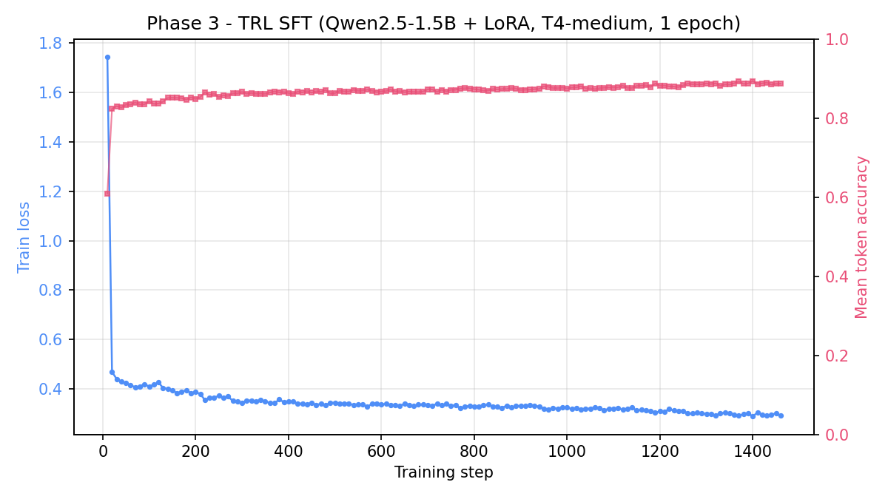
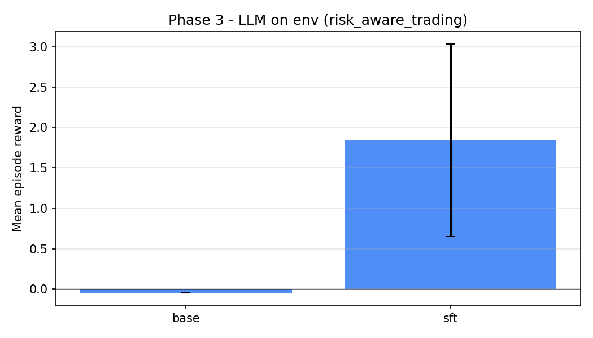
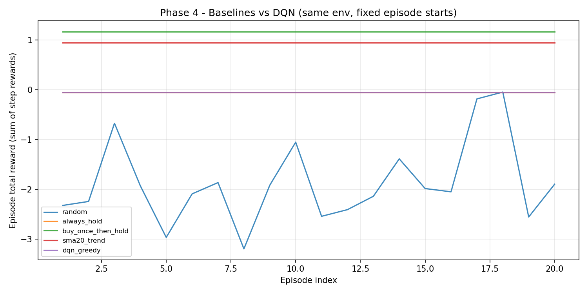
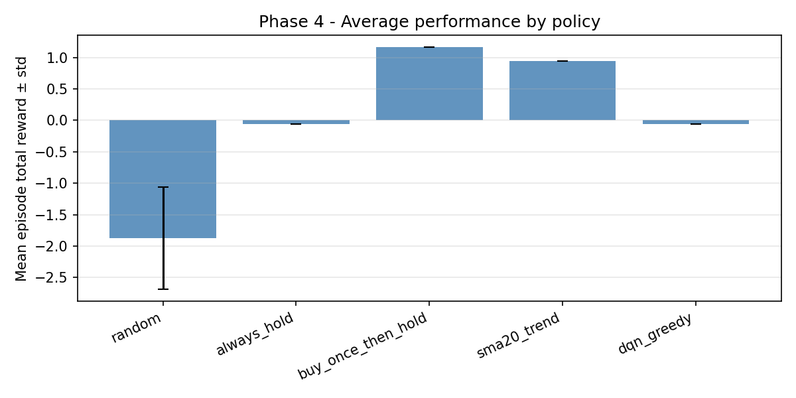

# 🛰️ AntiGravity: Strategic SPY Market Intelligence
**A high-fidelity Markov Decision Process (MDP) for Autonomous Financial Agents.**

---

## Submission thesis (Phase 0 — scope freeze)

This section is the **single source of truth** for hackathon scope and thesis. New **primary domains** require updating this section first. Criteria reference: [Apr ’26 OpenEnv Hackathon — themes & judging](https://docs.google.com/document/d/1AXXq9Mmjhjlwg2HmHiOLyQC9zee_MDmuqYXFy70fQuQ/edit?usp=sharing).

**Live Space (submission target):** [https://huggingface.co/spaces/Kj2461/metaOpenNV_V2](https://huggingface.co/spaces/Kj2461/metaOpenNV_V2)

### Theme alignment

| Role | Theme |
| :--- | :--- |
| **Primary** | **#3.1 Professional tasks** — a defined, partially observable **market world**: the agent consumes structured signals and tool-like state (prices, indicators, portfolio), acts through a strict API, and receives outcomes it cannot shortcut without maintaining internal state across steps. |
| **Secondary (pitch)** | **#2 Long-horizon planning & instruction following** — episodes unfold over many steps; good behavior depends on **sequences** of decisions under execution costs and shaped/delayed feedback, not a single-turn answer. |

### One sentence for judges

We give LLMs a **realistic SPY trading simulator** (OpenEnv-compliant) where they must map **multi-step market context + portfolio state** to **hold / buy / sell** under **transaction costs and composite risk-aware rewards**, so training improves **grounded decision-making under uncertainty** instead of generic financial chat.

### Problem → environment → reward → why an LLM gets better (five bullets)

1. **Problem:** Models are strong at financial prose but weak at **closed-loop control**: sizing actions, respecting friction, and staying coherent over long trajectories when the world pushes back bar-by-bar.
2. **Observation & action:** The agent sees a **fixed-length window** of engineered features (returns, trend distances, RSI, volume regime, volatility, VWAP distance, EMA/MACD/ATR-style signals) plus **cash, holdings, and portfolio value**; actions are **discrete** (hold / buy / sell) with an optional **continuous fraction** of cash or position to trade.
3. **Reward:** A **composite, dense-style** signal (portfolio change, downside pressure, risk-adjusted components, market-relative terms — see `reward.py`) so learning is guided **before** the episode ends, not only by a terminal label.
4. **Why an LLM gets better here:** The task forces **token-budget-friendly structured reasoning** over numeric state, **memory** of position and PnL path, and **incentive alignment** with a reward that penalizes naive churn and tail risk — capabilities that transfer to any agent that must **act** under constraints, not just describe markets.
5. **Scope freeze:** We **do not** add new primary domains (e.g. unrelated games or a second tradable asset) without updating this README section first. Docs, manifests, training Colab, and evaluation **must** stay aligned with the thesis above.

---

## Phase 1 (Judge materials)

Single place for reviewers (mirrored in [`docs/MATERIALS.md`](docs/MATERIALS.md)). **Do not** commit large video files; use URLs only.

| Artifact | URL | Notes |
| :--- | :--- | :--- |
| **Hugging Face Space** | [https://huggingface.co/spaces/Kj2461/metaOpenNV_V2](https://huggingface.co/spaces/Kj2461/metaOpenNV_V2) | Runnable environment |
| **GitHub source** | [https://github.com/kunaljaiswal2461-lab/metaOpenNV_V2](https://github.com/kunaljaiswal2461-lab/metaOpenNV_V2) | Version-controlled code |
| **OpenEnv manifest** | [`openenv.yaml`](openenv.yaml) | Default `observation_space.shape: [203]` matches `WINDOW_SIZE=20` in Docker |
| **Training on HF GPU** (recommended if you have Hub credits) | [`docs/HF_GPU_TRAIN.md`](docs/HF_GPU_TRAIN.md) | Second Space with `Dockerfile.train` + Nvidia hardware; pushes adapter to a **Model** repo (`HF_HUB_MODEL_ID`). |
| **Training Colab** (optional fallback) | [Open in Colab](https://colab.research.google.com/github/kunaljaiswal2461-lab/metaOpenNV_V2/blob/main/colab/phase3_trl_sft.ipynb) | Same TRL flow without a GPU Space. |
| **Mini-blog** (HF post) | *URL to be added in Phase 7* | &lt; 2 min read OK |
| **Demo video** (YouTube) | *URL to be added in Phase 7* | **&lt; 2 minutes**; link only |
| **Trained adapter (Hub model)** | [Kj2461/metaOpenNV-sft-qwen15](https://huggingface.co/Kj2461/metaOpenNV-sft-qwen15) | LoRA on `Qwen/Qwen2.5-1.5B-Instruct`, 1 epoch on 5,850 SFT rows from `risk_aware_trading`, T4-medium |
| **Plots / results** | [`results/phase4_episode_return.png`](results/phase4_episode_return.png), [`results/phase4_mean_return_bar.png`](results/phase4_mean_return_bar.png), [`results/phase4_metrics.md`](results/phase4_metrics.md), [`results/trl_sft_loss.png`](results/trl_sft_loss.png), [`results/phase3_eval_metrics.md`](results/phase3_eval_metrics.md), [`results/phase3_eval_bar.png`](results/phase3_eval_bar.png) | Phase 4: `python -m eval.phase4_benchmark`. Phase 3 train: HF GPU Space (auto). Phase 3 eval: `python scripts/eval_llm_on_env.py --models base=... sft=Kj2461/metaOpenNV-sft-qwen15 --local` |

### 3-minute read for judges

1. **Problem:** LLMs need grounded, multi-step **decisions under market friction**, not one-shot financial text.  
2. **Environment:** SPY bars + engineered features + portfolio state; **reset/step** API; episode sampling over held-out-style train split.  
3. **Results:**
   - **Phase 3 (LLM SFT closes the loop):** trained adapter [`Kj2461/metaOpenNV-sft-qwen15`](https://huggingface.co/Kj2461/metaOpenNV-sft-qwen15) lifts mean episode reward from **−0.04 → +1.84** and final portfolio value from **$10 000 → $10 719** vs the un-tuned base of the *same* Qwen 1.5B model on `risk_aware_trading` (10 ep × 300 steps). Teacher agreement doubles (0.20 → 0.40); action distribution shifts from 100% HOLD to 77/23/0 HOLD/BUY/SELL. Full table: [`results/phase3_eval_metrics.md`](results/phase3_eval_metrics.md), bar chart: [`results/phase3_eval_bar.png`](results/phase3_eval_bar.png).
   - **Phase 4 (classical baselines):** committed reward curves and [`results/phase4_metrics.md`](results/phase4_metrics.md).
4. **Why it matters:** Improves **tool-like control** and **long-horizon consistency** for professional / assistant-style agents (see Phase 0 themes).

---

## Phase 2: OpenEnv API contract

Aligned with hackathon engineering expectations (Gym-style loop, client/server split, manifest routes).

### Client vs server

| Layer | Rule |
| :--- | :--- |
| **Remote agent / judge client** | Use **`client.TradingEnv`** only: `requests` to **`/reset`**, **`/step`**, **`/state`**. Do **not** `import server` or `TradingEnvironment` in agent/inference code. |
| **Server** | `server/app.py` owns the `TradingEnvironment` singleton and exposes REST. |
| **Local RL trainer** | `training/train.py` may import `TradingEnvironment` directly for speed; this is **not** a remote-client pattern (called out in that file’s docstring). |

### HTTP routes (`openenv.yaml` `entrypoint.http.route`)

| Method | Path | Body | Returns |
| :--- | :--- | :--- | :--- |
| `POST` | `/reset` | Optional JSON `{"task_name": "spy_trading" \| "risk_aware_trading" \| "multi_horizon_trading"}` | `TradingObservation` |
| `POST` | `/step` | `{"action": 0\|1\|2, "amount": 0.0–1.0}` (default `amount=1.0`) | `TradingObservation` |
| `GET` | `/state` | — | `TradingState` (portfolio, step, `INITIAL_CASH`, `TRANSACTION_COST`) |

**Episode loop:** `reset` → repeat `step` until `done` on observation; call `state` anytime for a side-effect-free snapshot.

**Observation size:** `len(market_features) + 3` = `WINDOW_SIZE × 10 + 3` (see Phase 1 / `openenv.yaml`).

**MCP / tools:** Do not register custom tools named `reset`, `step`, `state`, or `close` — those names are reserved for the environment API.

### Verify client-only wiring

With the API running (`python server/app.py`):

```bash
python verify_shape.py
```

Static checks (no server):

```bash
python -m pytest tests/test_env.py -q
```

---

## Phase 3 (TRL supervised fine-tuning)

**Goal:** Turn **on-policy rollouts** from the same OpenEnv physics (HTTP `TradingEnv` against the live Space, or `--local` for dev) into **SFT rows** with an **SMA20-distance teacher** (`trl_data/prompt_utils.py`), then fine-tune a small causal / instruct model with **TRL `SFTTrainer`**.

**Install (not in Space Docker by default)**

```bash
pip install -r requirements-trl.txt
```

**Collect JSONL** (set `SPACE_URL` to your Space root, or pass `--local`):

```bash
set SPACE_URL=https://huggingface.co/spaces/Kj2461/metaOpenNV_V2
python scripts/collect_sft_dataset.py --episodes 12 --max-steps 400 --task-name risk_aware_trading
```

**Train** (GPU recommended; on CPU use a tiny model such as `distilgpt2` for smoke tests):

```bash
python scripts/trl_sft_train.py --data data/trl_sft_train.jsonl --epochs 1 --output-dir results/phase3_lora
```

**Train on Hugging Face (paid GPU / credits, no Colab):** create a **separate** Space from this repo, set **Dockerfile** to [`Dockerfile.train`](Dockerfile.train), enable **Nvidia T4+** hardware, and set secrets `HF_TOKEN` + `HF_HUB_MODEL_ID`. On boot, [`scripts/hf_train_and_push.py`](scripts/hf_train_and_push.py) collects from your live API Space, runs TRL, and **pushes** the latest checkpoint to the Hub model repo. Full walkthrough: [`docs/HF_GPU_TRAIN.md`](docs/HF_GPU_TRAIN.md).

**Outputs:** `data/trl_sft_train.jsonl` is gitignored (regenerate anytime); **`results/trl_sft_loss.png`** and adapter weights under **`--output-dir`**.

### Phase 3 production run (Apr 2026, T4-medium HF GPU Space)

The submission training was driven entirely from a second Hugging Face Space (`Kj2461/metaOpenNV_V2-train`) using [`Dockerfile.train`](Dockerfile.train) + [`scripts/hf_train_and_push.py`](scripts/hf_train_and_push.py) — no Colab. The Space binds a status page on boot, runs the full collect → SFT → push pipeline in-process, and pushes the LoRA adapter to a Model repo.

| Setting | Value |
| :--- | :--- |
| Base model | `Qwen/Qwen2.5-1.5B-Instruct` (auto-LoRA r=16, alpha=32, q/k/v/o + MLP) |
| Hardware | Nvidia T4-medium (16 GB), fp16 |
| Data | `risk_aware_trading`, 15 episodes × 390 steps = **5,850 rows** (collected in-process to avoid HF gateway rate-limits) |
| Wall clock | **1 h 33 m** for 1 epoch (1,463 steps, accumulation = 4) |
| Final train loss | **0.2914** (initial 1.7436) |
| Mean token accuracy | **0.8875** (initial 0.6092) |
| Adapter | [`Kj2461/metaOpenNV-sft-qwen15`](https://huggingface.co/Kj2461/metaOpenNV-sft-qwen15) (4.4 MB safetensors) |



**Closing the loop — base vs fine-tuned on the live env**

[`scripts/eval_llm_on_env.py`](scripts/eval_llm_on_env.py) auto-detects PEFT adapters: it reads `adapter_config.json`, loads the listed `base_model_name_or_path`, and applies `PeftModel.from_pretrained` on top. Pass either an HF repo id (e.g. `Kj2461/metaOpenNV-sft-qwen15`) or a local TRL output dir. For dev without a running Space, add **`--local`** (same physics as `collect_sft_dataset --local`). Qwen tokenizers need **`sentencepiece`** (listed in `requirements-trl.txt`).

```bash
python scripts/eval_llm_on_env.py \
  --models base=Qwen/Qwen2.5-1.5B-Instruct sft=Kj2461/metaOpenNV-sft-qwen15 \
  --episodes 10 --max-steps 300 --task-name risk_aware_trading --local
```

**Submission run (10 episodes × 300 steps, `risk_aware_trading`, `--local`, T4-medium):**

| Model | Mean episode reward | Std | Last final PV | HOLD | BUY | SELL | Teacher agreement |
|---|---:|---:|---:|---:|---:|---:|---:|
| base (Qwen 1.5B Instruct, no SFT) | -0.0444 | 0.0000 | $10,000.00 | 100.0% | 0.0% | 0.0% | 0.201 |
| **sft** (base + LoRA on env trajectories) | **+1.844** | 1.190 | **$10,718.64** | 77.2% | 22.6% | 0.1% | **0.401** |

What changed after one epoch of SFT on 5,850 env rows:

- **Reward**: base is stuck at the baseline penalty (it never trades); SFT lifts mean episode reward by **+1.89** with positive returns in 9/10 episodes (peak +3.87 reward / +31% PV).
- **Action diversity**: base degenerates to 100% HOLD; SFT learns **77/23/0** HOLD/BUY/SELL — it actually deploys cash when the SMA20 / momentum signals line up.
- **Teacher agreement**: jumps from **0.20 → 0.40** (2× the SMA20 trend teacher), even though the fine-tuned model is free to deviate from the teacher.
- **Risk-side**: SFT shows higher variance than base (1.19 std vs 0.0) — that is the price of trading at all; one of 10 episodes ended below $10k. Track-H below addresses this with the richer prompt + composite teacher.

Full table + bar chart auto-committed: [`results/phase3_eval_metrics.md`](results/phase3_eval_metrics.md), [`results/phase3_eval_bar.png`](results/phase3_eval_bar.png) (also mirrored on the model repo at `https://huggingface.co/Kj2461/metaOpenNV-sft-qwen15/tree/main/results`).



**Track-H (richer prompt + bigger model, optional, paid GPU on HF or Colab):**

```bash
python scripts/collect_sft_dataset.py \
  --episodes 30 --max-steps 400 --task-name multi_horizon_trading \
  --prompt full --teacher composite --history-len 5 \
  --out data/trl_sft_train_full.jsonl
python scripts/trl_sft_train.py --data data/trl_sft_train_full.jsonl \
  --model-id Qwen/Qwen2.5-3B-Instruct --epochs 1 --output-dir results/phase3_lora_3b
python scripts/eval_llm_on_env.py --models sft_3b=results/phase3_lora_3b \
  --prompt full --history-len 5 --task-name multi_horizon_trading
```

**Judges:** the live **Space** URL in Phase 1 is the runnable env; training is reproducible via **HF GPU Space** ([`docs/HF_GPU_TRAIN.md`](docs/HF_GPU_TRAIN.md)) or the optional Colab notebook.

---

## Phase 4 (Results)

**Goal:** Observable evidence vs baselines on the **same** `TradingEnvironment` physics as the server (local eval for reproducible plots).

**How to regenerate**

```bash
python -m eval.phase4_benchmark
# optional: python -m eval.phase4_benchmark --eval-episodes 30 --train-episodes 120
```

**Episode total reward** (sum of per-step rewards) by policy — each line is one policy over consecutive evaluation episodes (`random_episode_start=False` for a controlled comparison):



**Mean episode reward ± std** across policies (same eval episodes as above):



**Table (auto-generated, committed):** see [`results/phase4_metrics.md`](results/phase4_metrics.md).

**Reading the run:** `random` is destructive on average; `always_hold` is the cash baseline; **`buy_once_then_hold`** and **`sma20_trend`** are simple structured policies that capture upside on this SPY split; **DQN (greedy)** here matches `always_hold` under the default short training + fixed-start eval — raise `--train-episodes` or use **Phase 3 TRL SFT** on trajectories for judge-facing “LLM improved after training” evidence.

---

## 🧭 SYSTEM NAVIGATION
[Phase 1](#phase-1-judge-materials) | [Phase 2](#phase-2-openenv-api-contract) | [Phase 3](#phase-3-trl-supervised-fine-tuning) | [Phase 4](#phase-4-results) | [🏠 Overview](#-getting-started) | [⚙️ Specifications](#-environment-specification) | [📉 Market Dynamics](#-data--market-dynamics) | [🎯 Scoring](#-tasks--scoring) | [🤖 Agent Loop](#-agent--api) | [📁 Structure](#-file-structure)

---

## 💡 GETTING STARTED

### 🌟 Project Overview
AntiGravity is a specialized Reinforcement Learning environment designed for the **S&P 500 ETF (SPY)**. It simulates a high-frequency trading arena where agents must leverage technical signals to optimize risk-adjusted returns against a realistic "Market Physics" engine.

### 🚀 Quick Launch
```bash
# 1. Install Industry Standard Dependencies
pip install -r requirements.txt

# 2. Start the FastAPI + Gradio Orchestrator
python server/app.py

# 3. Launch the LLM Baseline Agent
python inference.py
```

---

## ⚙️ ENVIRONMENT SPECIFICATION

### 🎮 The Action Space
The environment utilizes a **Hybrid Discrete-Continuous** action space:
- **`0: HOLD`** — Maintains current position. Zero transaction cost.
- **`1: BUY`** — Allocates available cash into SPY (with 0.1% slippage penalty).
- **`2: SELL`** — Liquidates SPY holdings at the next 1-min candle close.

### 👁️ Observation stack (window × 10 + 3)

The flattened RL vector length is **`WINDOW_SIZE × 10 + 3`**: `market_features` has length **`WINDOW_SIZE × 10`**, plus **3** portfolio scalars (`port_cash`, `holdings`, `port_val` / `portfolio_value`). The default Space uses **`WINDOW_SIZE=20`** → **203** total (`openenv.yaml`). Tasks use windows **10 / 20 / 50** → **103 / 203 / 503** when you pass `task_name` on reset (see API).

| Layer | Dimensions (default) | Purpose |
| :--- | :--- | :--- |
| **Temporal window** | 200 in `market_features` (20 × 10) | Past 20 bars of 10 engineered features (see `data/preprocess.py`). |
| **Portfolio state** | 3 separate JSON fields | Cash (USD), holdings (shares), portfolio value (USD). |

### 🛠️ Market Physics Engine
- **Transaction Tax**: A 0.1% fixed cost per trade, modeling exchange fees and slippage.
- **Margin Safety**: Automatic liquidation if Portfolio Value < 40% of Initial Capital.
- **Execution**: All trades are executed at the **Closing Price** of the current minute.

---

## 📉 DATA & MARKET DYNAMICS

### 📊 Technical Indicator Reference
| Indicator | Key | Formula | Market Logic |
| :--- | :--- | :--- | :--- |
| **Log Return** | `log_ret` | `ln(P_t / P_t-1)` | Removes price scaling bias. |
| **SMA Dist (5)** | `sma_5` | `(P - SMA5)/SMA5` | Measures short-term mean-reversion. |
| **SMA Dist (20)**| `sma_20` | `(P - SMA20)/SMA20`| Measures medium-term trend strength. |
| **RSI (14)** | `rsi` | `14-period RSI` | Normalized oscillator (0-1). |
| **Volume Norm** | `vol` | `V / SMA_20(V)` | Validates strength of price moves. |
| **Volatility** | `volat` | `StdDev(Ret, 10)` | Identifies high-risk market regimes. |
| **VWAP distance** | `vwap_dist` | `(Close - VWAP) / VWAP` | Price vs cumulative-volume typical price. |
| **EMA12 distance** | `ema12_dist` | `(Close - EMA12) / EMA12` | Short trend alignment. |
| **MACD vs signal** | `macd_signal_gap` | `MACD_hist / Close` | Momentum vs signal, normalized. |
| **ATR%** | `atr_pct` | `ATR(14) / Close` | Volatility regime scaling. |

---

## 🎯 TASKS & SCORING

### 🏹 The Curriculum
We test agents across three progressive difficulty tiers (configured in `openenv.yaml`):
1. **`spy_trading`**: Basic trend following (10-min window).
2. **`risk_aware_trading`**: Standard industry benchmark (20-min window).
3. **`multi_horizon_trading`**: Deep sequence planning (50-min window).

### 🎁 Reward Shaping Architecture
Derived from the **Stanford GSB research (Moody & Saffell)**, the system uses a weighted composite reward (`α=0.4, β=0.25, γ=0.15`):
- **Log Return Component**: Direct profit maximization.
- **Downside Risk Penalty**: Exponential penalty for absolute losses.
- **Differential Sharpe Ratio**: A recursive gradient for risk-adjusted alpha.
- **Treynor Contribution**: Rewards performance relative to SPY's baseline beta.

---

## 🤖 AGENT & API

### 🧠 LLM Inference Cycle
The baseline `inference.py` follows a strict logic loop:
1. **Sanitize**: Observations are cleaned of `NaN` or `Inf` values for LLM stability.
2. **Context**: Prompting uses expert-trader personas to guide action selection.
3. **Decision**: The model consumes the full observation vector (length depends on `WINDOW_SIZE`) and outputs a discrete action.

### 📡 API Architecture
The Space exposes a standard REST interface for remote agent connectivity (see **Phase 2** for the full contract):
- `POST /reset`: Initialize a new episode. Optional JSON body: `{"task_name":"spy_trading"}` or `"risk_aware_trading"` or `"multi_horizon_trading"` (matches `openenv.yaml` tasks and sets the lookback window).
- `POST /step`: Execute action and return MDP state (JSON body: `TradingAction` — `action` 0/1/2, optional `amount` 0–1).
- `GET /state`: Read portfolio and metadata without advancing the simulator.

---

## 📁 FILE STRUCTURE
```text
rl-trading/
├── server/                     # Backend Orchestration
│   ├── app.py                  # Live Gateway (Gradio + FastAPI)
│   └── trading_environment.py  # Core Physics & Logic
├── data/                       # Intelligence Layer
│   ├── preprocess.py           # Technical Indicator Factory
│   └── spy_prices.csv          # High-Frequency CSV Feed
├── models.py                   # Protocol Buffers / Schemas
├── reward.py                   # Reward Shaping Engine
└── inference.py                # Agent Loop Baseline
```

---
*Developed for the Meta RL Trading Hackathon | Built with openenv-core*
